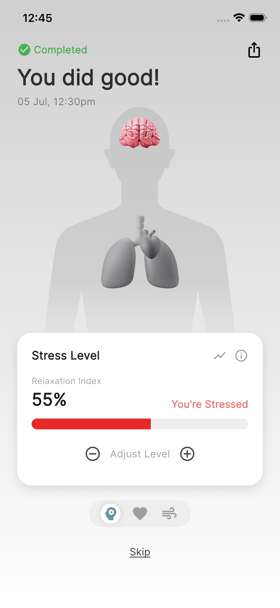
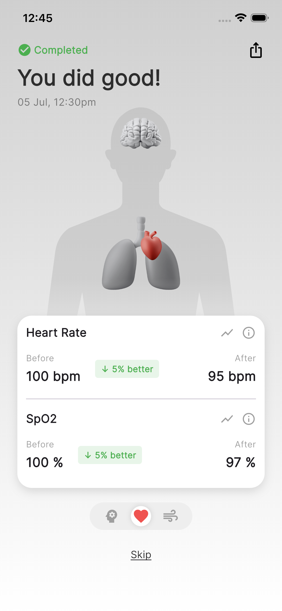
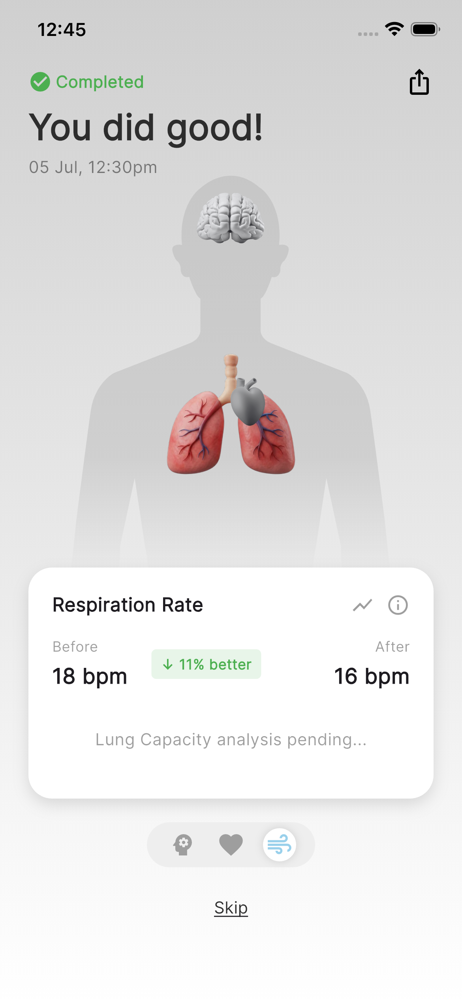
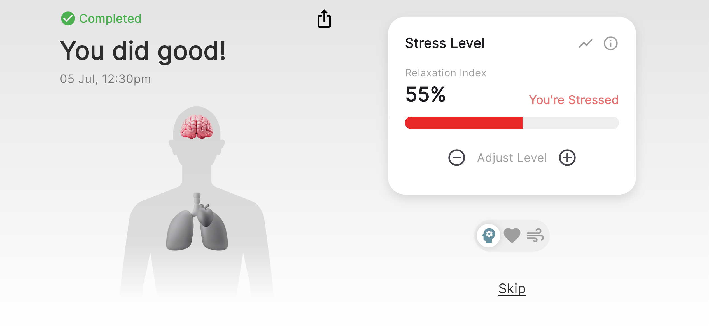
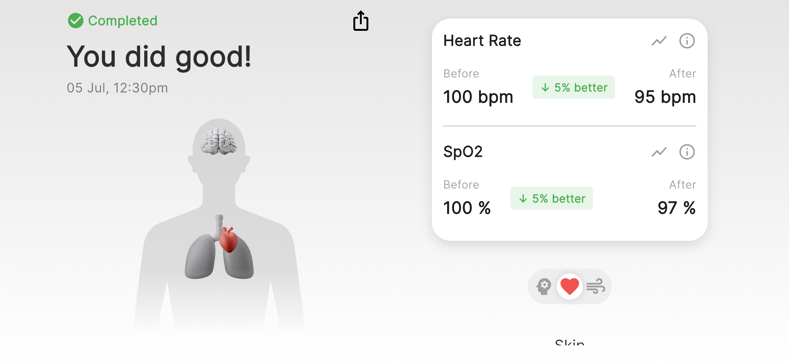
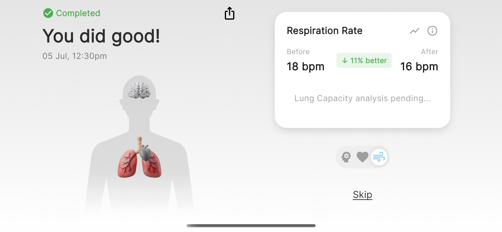

# 🏥 Health Monitor Flutter UI

A sophisticated health monitoring dashboard concept built with **Flutter**. This project demonstrates complex UI implementation, including interactive anatomical layers, custom data visualization, and responsive design principles.

## ✨ Key Features

- **🫀 Interactive Anatomy:** A layered stack visualization allowing users to toggle between different organs (Brain, Heart, Lungs) with visual feedback.
- **📊 Dynamic Data Charts:** Custom-built bar charts for tracking stress levels and respiration rates without external heavy libraries.
- **🎨 Advanced Styling:** Utilizes `ShaderMask`, linear gradients, and `ClipRRect` for a modern, glass-like aesthetic.
- **⚡ State Management:** Efficiently manages app state and UI updates using **Provider**.
- **📱 Responsive Design:** Adapts anatomically aligned assets to different screen sizes using relative positioning.

## 🛠️ Tech Stack

- **Framework:** Flutter (Dart)
- **State Management:** Provider
- **Assets:** Optimized SVGs & PNGs
- **Fonts**: Poppins (Google Fonts)

## 📸 Screenshots

  
  
  
  
  
  

